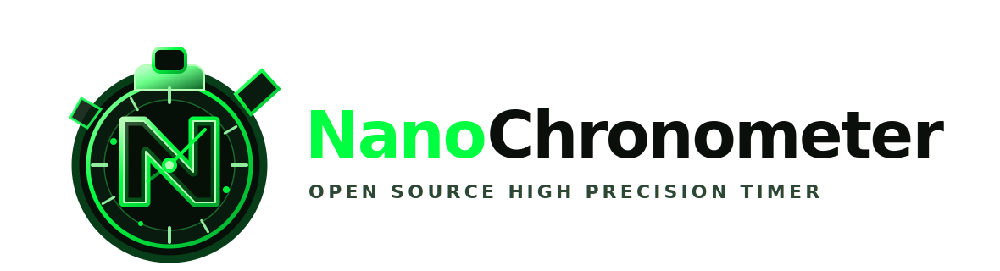

# NanoChronometer

High-resolution stopwatch and microbenchmark GUI for Windows x64. The timing core reads the CPU Time Stamp Counter (TSC) through hand-written x86-64 assembly, calibrates it against `QueryPerformanceCounter`, and exposes both a reusable C API and a Win32 GUI.

```
00:00:12:347:891:042
hh:mm:ss:mmm:uuu:nnn
```

## What changed in this version

- The benchmark panel now has three real modes:
  - **Mode 1: CPU/timer ISA benchmark** - runs only counter/timer backends: legacy scalar ASM, MMX, SSE/SSE2/SSE3/SSSE3/SSE4.1/SSE4.2, AVX, F16C, FMA, AVX2, AVX-VNNI, AVX-512 and AVX-512 VNNI.
  - **Mode 2: OpenSSL EVP benchmark** - runs real OpenSSL EVP calls such as AES-256-GCM, SHA-256, and ChaCha20-Poly1305.
  - **Mode 3: libsodium benchmark** - runs real libsodium calls such as AES-256-GCM when available, `crypto_hash_sha256`, and ChaCha20-Poly1305-IETF.
- `bench_kernels.c` and `bench_kernels_avx2.c` split portable/SSE-family kernels from AVX2 kernels so the timing library itself is no longer compiled with global `/arch:AVX2`.
- `build_all.bat` no longer contains corrupted paths such as `dist\assets` with control characters.
- `CMakeLists.txt` has been repaired and no longer has the broken nested `if()` block.
- DLL export files now include the CPU feature API declared in `nanochrono.h`.
- The stopwatch stop/pause accumulation bug has been fixed.
- Benchmark log access is protected by a `CRITICAL_SECTION`.

## Features

- **Nanosecond-format display** using calibrated TSC ticks.
- **Dual ASM timing backends**:
  - Legacy backend: CPUID-serialized TSC reads and SSE2 memory helpers.
  - AVX backend: LFENCE/RDTSCP TSC reads and AVX memory helpers.
- **Runtime dispatch** via CPUID + XGETBV.
- **SIMD backbuffer clear** using the best available assembly backend.
- **Custom font embedding** from `assets\font\*.ttf` or `assets\font\*.otf`.
- **Drift monitoring** against QPC in PPM.
- **Benchmark log export** from the GUI.

## Important accuracy note

NanoChrono formats elapsed time down to nanoseconds, but that does not mean Windows scheduling, rendering, or user input are truly nanosecond-accurate. Direct TSC timing is useful for short intervals and microbenchmarks. For general wall-clock timing, `QueryPerformanceCounter` remains the safest Windows API. NanoChrono calibrates TSC against QPC and shows drift to make that tradeoff visible.

## CRT note

This project uses C runtime functions such as `calloc`, `free`, `snprintf`, and secure CRT formatting helpers. It uses `WinMainCRTStartup` for the GUI entry point, but it is **not** a strict no-CRT project. The build scripts keep `/GS` enabled instead of disabling stack cookies.

## Controls

| Key | Action |
|-----|--------|
| `Space` / `P` | Start, pause, resume |
| `S` | Stop and keep elapsed time |
| `R` | Reset |
| `B` | Show/hide benchmark panel |
| `M` | Toggle nano/simple display mode |
| `ESC` | Exit |
| Drag | Move borderless window |

## Prerequisites

- Windows 10 or later, x86-64.
- MSVC from Visual Studio 2019/2022, opened from an **x64 Native Tools Command Prompt**.
- NASM 2.15 or newer.
- Python 3 is optional and only used for icon generation.
- Optional bundled crypto libraries under `externals\openssl` and/or `externals\libsodium` for benchmark modes 2 and 3.


### Windows crypto link notes

When linking the bundled static OpenSSL `libcrypto.lib`, the executable/DLLs also need Windows system import libraries: `advapi32.lib`, `crypt32.lib`, `ws2_32.lib`, `user32.lib`, and `bcrypt.lib`. `build_all.bat` and `CMakeLists.txt` add these automatically.

The bundled `externals/libsodium/lib/libsodium.lib` is treated as a static library when `externals/libsodium/bin/libsodium.dll` is absent. In that case the build defines `SODIUM_STATIC` automatically so symbols such as `sodium_init` resolve correctly instead of being emitted as `__imp_sodium_init`.

## Building with the batch script

```bat
build_all.bat
```

Useful variants:

```bat
build_all.bat REBUILD
build_all.bat CLEAN
build_all.bat LIBS
build_all.bat GUI
build_all.bat OPENSSL
build_all.bat LIBSODIUM
build_all.bat BOTH
```

The default `AUTO` crypto mode chooses `BOTH` if both import libraries are present, otherwise the one it finds.

Output layout:

```text
dist\
  nanochrono_gui.exe
  assets\
  dynamic_libs\
    bin\
      nanochrono.dll
      nanochrono_avx.dll
    include\
      nanochrono.h
    lib\
      nanochrono.lib
      nanochrono_avx.lib
  static_libs\
    include\
      nanochrono.h
      bench_kernels.h
    lib\
      legacy\nanochrono_static.lib
      avx\nanochrono_avx_static.lib
```


### Windows crypto link notes

When linking the bundled static OpenSSL `libcrypto.lib`, the executable/DLLs also need Windows system import libraries: `advapi32.lib`, `crypt32.lib`, `ws2_32.lib`, `user32.lib`, and `bcrypt.lib`. `build_all.bat` and `CMakeLists.txt` add these automatically.

The bundled `externals/libsodium/lib/libsodium.lib` is treated as a static library when `externals/libsodium/bin/libsodium.dll` is absent. In that case the build defines `SODIUM_STATIC` automatically so symbols such as `sodium_init` resolve correctly instead of being emitted as `__imp_sodium_init`.

## Building with CMake

```bat
cmake -S . -B build -G "Visual Studio 17 2022" -A x64 -DNC_CRYPTO_BACKEND=BOTH
cmake --build build --config Release
```

Valid values for `NC_CRYPTO_BACKEND` are `AUTO`, `OPENSSL`, `LIBSODIUM`, and `BOTH`.

## Benchmark modes

### Mode 1: CPU intrinsics

Runs NanoChrono's own intrinsic kernels. The timing path is intentionally low-level and CPU-feature-oriented. The AVX2 code lives in `bench_kernels_avx2.c`, which is compiled separately with `/arch:AVX2` so `nanochrono.c` and the base benchmark kernels remain portable.

### Mode 2: OpenSSL EVP

Runs real EVP operations. Depending on the selected row, it benchmarks AES-256-GCM, SHA-256, or ChaCha20-Poly1305 through OpenSSL's normal provider/dispatch path.

### Mode 3: libsodium

Runs real libsodium operations. AES-GCM rows use `crypto_aead_aes256gcm_encrypt` when libsodium reports it is available; otherwise they fall back to ChaCha20-Poly1305-IETF. SHA rows use `crypto_hash_sha256`.

## C API example

```c
#include "nanochrono.h"

nc_ctx_t *ctx = nc_create();

nc_start(ctx);
/* work */
uint64_t ns = nc_elapsed_ns(ctx);

char buf[32];
nc_format_ns(ns, buf, sizeof(buf));

nc_destroy(ctx);
```

## Architecture

```text
nanochrono_legacy.asm   CPUID/RDTSC/SSE2 backend
nanochrono_avx.asm      LFENCE/RDTSCP/AVX backend
nanochrono.c            high-level C API, calibration, drift tracking
bench_kernels.c         scalar/MMX/SSE timer-family benchmark kernels
bench_kernels_avx2.c    AVX/F16C/FMA/AVX2/AVX512 timer-family benchmark kernels
main.c                  Win32 GUI, state machine, benchmark orchestration
app.rc                  icon/resource wiring
```

## Distribution notes

Do not commit generated output from `obj\` or `dist\`. If you redistribute OpenSSL or libsodium binaries, include their license files and any required notices alongside your release package. See `THIRD_PARTY_NOTICES.md` for the expected release layout.

## License

MIT

## 2026 update: GUI/CLI, SIMD families and safe CSV evidence

This source package now includes both GUI and CLI workflows:

- `nanochrono_gui.exe`: resizable/maximizable Win32 frontend. The benchmark panel
  lists legacy scalar ASM, MMX, the SSE family, AVX, F16C,
  FMA, AVX2, AVX-VNNI and AVX-512 feature rows. Rows are gated by CPUID/XGETBV so
  unavailable instruction families are shown as `NOT AVAILABLE` and are not
  executed.
- `nanochrono_cli.exe`: CSV runner for large sample counts, e.g. 1,000,000
  iterations.

Example:

```bat
build_all.bat REBUILD BOTH

dist\nanochrono_cli.exe --mode cpu --algo all --iterations 1000000 --kernel-loops 1 --warmup 10000 --pin-core 2 --priority high --csv results.csv
```

The high-level backend selector now reports a named backend instead of only
`legacy`/`AVX`: legacy ASM, MMX, SSE/SSE2/SSE3/SSSE3/SSE4.1/SSE4.2, AVX, F16C,
FMA, AVX2, AVX-VNNI and AVX-512 families are represented. AVX-family timing paths
are only used after OSXSAVE/XGETBV verifies YMM/ZMM state support, which prevents
illegal-instruction crashes on older CPUs.

See `PMU_DISCLOSURE_LAB.md` for the safe scope of PMU/side-channel style
measurements. This build intentionally avoids arbitrary external-PID profiling;
CSV evidence is intended for self-process, child-process or synthetic lab targets.


## ISA-isolated backend ASM files

NanoChrono now keeps non-baseline instruction families in separate NASM source files:

`nanochrono_mmx.asm`, `nanochrono_sse.asm`, `nanochrono_sse2.asm`, `nanochrono_sse3.asm`,
`nanochrono_ssse3.asm`, `nanochrono_sse4.asm`, `nanochrono_sse41.asm`,
`nanochrono_sse42.asm`, `nanochrono_f16c.asm`, `nanochrono_fma.asm`,
`nanochrono_avx2.asm`, `nanochrono_avx512.asm`,
`nanochrono_avx512_vnni.asm`, and `nanochrono_avx_vnni.asm`.

The unified GUI/CLI links all of them, but `nanochrono.c` dispatches only after CPUID
and XGETBV checks. This means unsupported opcodes can exist in the executable without
causing `illegal instruction`; the crash only happens if the unsupported routine is
actually called, and the dispatcher prevents that.

AVX-VNNI is separate from AVX-512 VNNI. AVX-VNNI uses the CPUID leaf 7, subleaf 1
EAX bit 4 capability and YMM OS state, while AVX-512 VNNI uses leaf 7, subleaf 0
ECX bit 11 plus ZMM OS state.


## Timer backend vs crypto provider

The status bar reports only the active timer backend. It must never show AES-NI, PCLMULQDQ, SHA-NI or VAES as the counter backend. Those are crypto acceleration features and are measured through OpenSSL EVP or libsodium benchmark modes. Valid counter backends are legacy scalar ASM, MMX, SSE, SSE2, SSE3, SSSE3, SSE4.1, SSE4.2, AVX, F16C, FMA, AVX2, AVX-VNNI, AVX-512 and AVX-512 VNNI.

## 2026 portability update

This tree was reorganized for portable native libraries and Python FFI/wheel use:

- x64 assembler is kept as NASM `.asm` under:
  - `asm/x64/windows`
  - `asm/x64/linux`
- ARM64 assembler is kept as `.S` under:
  - `asm/arm64/windows`
  - `asm/arm64/linux`
- ARM64 families are split into scalar legacy, NEON, SVE, SVE2, SME, and SME2 files so runtime code can select a safe implementation and avoid illegal-instruction faults.
- External crypto layout is architecture/platform-specific:
  - `externals/x64/windows/{openssl,libsodium}`
  - `externals/x64/linux/{openssl,libsodium}`
  - `externals/arm64/windows/{boringssl,libsodium}`
  - `externals/arm64/linux/{boringssl,libsodium}`
- OpenSSL is intentionally not used for ARM64; use BoringSSL and/or libsodium there.
- CMake supports Ninja and Unix Makefiles. MSVC and MinGW builds are both supported for the core shared/static libraries.
- Added FFI/interpreted-language overhead APIs:
  - `nc_measure_ffi_overhead_cycles(ctx, iterations)`
  - `nc_measure_call_overhead_cycles(ctx, callback, arg, iterations)`
- Added a Python package skeleton (`pyproject.toml`, `python/nanochronometer`) that loads the native DLL/SO through `ctypes`. Set `NANOCHRONO_LIB` if the library is not beside the package or in the working directory.

### Build examples

MSVC + Ninja from an x64 Developer Command Prompt:

```bat
cmake -S . -B build-msvc-ninja -G Ninja -DNC_CRYPTO_BACKEND=AUTO
cmake --build build-msvc-ninja --config Release
```

MinGW + Ninja:

```bat
cmake -S . -B build-mingw-ninja -G Ninja -DNC_CRYPTO_BACKEND=AUTO -DNC_BUILD_GUI=OFF
cmake --build build-mingw-ninja
```

Linux + Unix Makefiles:

```sh
cmake -S . -B build-unix -G "Unix Makefiles" -DNC_CRYPTO_BACKEND=AUTO
cmake --build build-unix
```

Python wheel metadata/package:

```sh
python -m build
```

The wheel wrapper is pure Python and expects a previously built `nanochrono` native library (`nanochrono.dll`, `libnanochrono.so`, or `libnanochrono.dylib`).

## Language wrappers

NanoChronometer now ships wrapper skeletons under `wrappers/` for Rust, Go, C#/.NET, Java/JNA, Node.js, Zig and LuaJIT. These are intentionally thin so you can measure the real overhead of calling into the native library from each runtime.

Typical workflow:

1. Build `nanochrono` as shared or static with CMake.
2. Put `nanochrono.dll`, `libnanochrono.so`, or `libnanochrono.dylib` where the runtime loader can find it.
3. Run the `overhead` example for the wrapper you want to benchmark.

Examples measure both native timer overhead and FFI/callback overhead, which is useful when comparing Python wheels, Rust FFI, Go/cgo, .NET P/Invoke, Java/JNA, Node ffi-napi, Zig and LuaJIT.

## 2.0.0 unified instruction toolkit

NanoChronometer now follows the OpenSSL/FFmpeg style: build one `nanochrono` library per OS/architecture and dispatch instruction families at runtime instead of producing one library per instruction set. x64 uses NASM `.asm`; ARM64 uses assembler `.S`. Unsupported instruction families return `NC_ERR_UNSUPPORTED` to avoid `illegal instruction`.

See `UNIFIED_DISPATCH_AND_INSTRUCTION_TOOLKIT.md` for the new ASM symbols, C APIs, crypto timing helpers and binding notes.


## Side-channel audit and pro benchmark modes

This build includes a defensive timing-audit API in the library, not only in the UI/CLI:

- `NC_BENCHMARK_BLACK_BOX_CRYPTO`: measures public EVP / BoringSSL / libsodium calls.
- `NC_BENCHMARK_GRAY_BOX_INTERNAL`: measures internal block-level kernels when available.
- `NC_BENCHMARK_WHITE_BOX_ASM`: measures direct x64/ARM64 assembly microkernels.

The public catalog API (`nc_microbench_catalog_count`, `nc_microbench_catalog_entry`,
`nc_microbench_run`) exposes approximately 300 generated x64 white-box assembly
functions and 300 generated ARM64 white-box assembly functions. Optional x64 ISA
families are guarded by `nc_microbench_available()` so callers can avoid illegal
instruction faults.

Defensive side-channel measurement is exposed through
`nc_sidechannel_audit_constant_time()`, which runs fixed-vs-random local timing
samples and reports Welch t-score, cycle statistics, and a heuristic leak flag.
It is designed for constant-time validation of code the caller owns; it does not
implement secret recovery or cross-process attack orchestration.

Nanosecond stopwatch helpers are also available through `nc_stopwatch_ns_*`.

## Android Termux CLI

NanoChronometer can also be built as a native Android ARM64 executable inside
Termux. This is separate from the Android NDK library-only build.

```sh
pkg install clang cmake ninja make git
./scripts/build_termux_arm64_cli.sh
```

Output:

```text
build/termux-arm64/static/bin/nanochrono_cli
```

See `TERMUX_ANDROID_CLI.md` for install options and notes.
